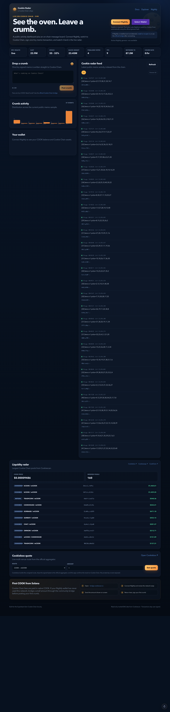

# Cookie Radar

Cookie Radar is a public Cookie Chain cApp built for the
[Create an App on Cookie Chain](https://superteam.fun/earn/listing/create-an-app-on-cookie-chain-app)
bounty. It combines a live network dashboard, an on-chain message board, wallet
asset discovery, and a liquidity radar in one fully client-side application.

> **Try it live:** [yufeng66688.github.io/cookie-radar](https://yufeng66688.github.io/cookie-radar/)
>
> **Source:** [github.com/yufeng66688/cookie-radar](https://github.com/yufeng66688/cookie-radar)
>
> No private keys are required to run the app.



## What it does

- **Nightly wallet support:** detects the Nightly extension and asks it to switch
  to Cookie Chain using the official genesis hash and RPC endpoint.
- **Wallet connection:** displays the connected address, native COOK balance,
  approximate USD value, adapter name, and a direct Cookiescan link.
- **On-chain crumb:** lets a connected wallet sign and send a short Memo
  transaction directly to Cookie Chain.
- **Transaction status:** shows Sign → Send → Confirm stages, broadcasts the
  signature, confirms on `confirmed` commitment, and surfaces cancellation,
  insufficient-funds, wrong-network, and in-flight errors clearly.
- **Live activity radar:** reads the latest public Memo transactions from the
  Cookie Chain Memo program, including message, signature, slot, timestamp,
  and confirmation status.
- **Activity chart:** buckets the current memo sample into a small SVG chart and
  highlights the most common hashtags.
- **Wallet assets:** calls the official Cookiescan DAS endpoint
  (`getAssetsByOwner`) to display NFTs and fungible assets indexed for the wallet.
- **Liquidity radar:** reads Cookiescan markets to show live COOK price and the
  largest CookieSwap / Cookiebox / Meteora pools.
- **Cookiebox quote + swap:** calls `agg.cookiebox.app` for live routes between
  popular Cookie Chain pairs, shows estimated output, fee, price impact, and venue
  legs, and lets a connected Nightly wallet simulate, sign, submit, and confirm it.
- **Bridge guide:** explains the first-time COOK funding flow with links to the
  official Cookie Chain bridge and relevant ecosystem tools.

## Why it works

Cookie Chain is a Solana-compatible SVM. The app therefore uses standard Solana
tools (`@solana/web3.js`, Wallet Adapter, Nightly adapter) with the Cookie Chain
community RPC. A user can either post a tiny signed Memo instruction or execute a
Cookiebox-built swap; there is no backend, no indexer to trust, and no custody
at any point.

## Demo flow

1. Install the [Nightly wallet](https://nightly.app) extension.
2. Open the deployed app.
3. Click **Connect Nightly**. The app calls `nightly.solana.changeNetwork()` with:
   - genesis hash: `9wDaBRDgArEUpvhHxGguNkwozsZh4UpGZB9o2EoEcBB2`
   - RPC: `https://rpc.cookiescan.io`
4. Approve the network change in Nightly.
5. Type a short message and click **Post crumb**.
6. Approve the signature, then watch **Sign → Send → Confirm** update live.
7. Open the new transaction in [Cookiescan](https://cookiescan.io).

Optional swap flow:

1. Connect Nightly.
2. In **Cookiebox quote**, choose a pair and enter an amount.
3. Click **Get quote**, review the route, then click **Execute swap**.
4. Approve one signature in Nightly and wait for confirmation.

If the wallet has no COOK, follow the bridge guide at the bottom of the page or
go directly to [bridge.cookiescan.io](https://bridge.cookiescan.io).

## Requirements

- Node.js 22 or newer
- npm 10 or newer
- A modern browser with the Nightly extension for signing
- Public network access to `rpc.cookiescan.io` and `api.cookiescan.io`

## Local development

```bash
npm install
npm run dev
```

Open `http://localhost:5173`.

Optional environment variables are documented in `.env.example`. The defaults
point at the official public endpoints, so no environment setup is required.

## Production build

```bash
npm run build
npm run preview
```

The deployable output is written to `dist/`. The project is a static SPA with no
server-side secrets, so it can be hosted on any static host.

## Deploy

### Vercel

1. Push this repository to GitHub.
2. In Vercel, choose **Import Project** and select the repository.
3. Confirm framework is **Vite**, build command `npm run build`, output `dist`.
4. Deploy and use the generated public URL.

The included `vercel.json` already contains the Vite settings.

### Netlify

1. Push the repository to GitHub.
2. In Netlify, choose **Add new site → Import an existing project**.
3. Build command `npm run build`, publish directory `dist`.
4. Deploy.

The included `netlify.toml` already contains the SPA redirect.

### Cloudflare Pages

1. Push the repository to GitHub.
2. In Cloudflare Pages, create a new project from the repository.
3. Build command `npm run build`, output directory `dist`.

## Architecture

```text
src/
  App.tsx                    page composition + data refresh
  Providers.tsx              Solana Connection + WalletProvider + Nightly adapter
  components/
    CookieConnect.tsx        Nightly network switch + connect flow
    CrumbComposer.tsx        memo transaction + status handling
    WalletPanel.tsx          address, COOK balance, DAS assets
    ChainStats.tsx           RPC health / slot / epoch / TPS / validators
    Feed.tsx                 live Memo feed + filters + tags
    ActivityChart.tsx        SVG activity buckets
    MarketRadar.tsx          Cookiescan pool and COOK price card
    CookieBoxQuote.tsx       Cookiebox quote + user-signed swap card
  lib/
    cookie.ts                Cookie Chain constants, RPC, DAS, formatting
    nightly.ts               Nightly injected-wallet interface
```

## Integration sources

- Cookie Chain RPC: `https://rpc.cookiescan.io`
- Cookiescan DAS: `https://api.cookiescan.io`
- Cookiescan markets: `https://api.cookiescan.io/api/markets`
- Cookiescan price: `https://api.cookiescan.io/api/price/cook`
- Cookiebox aggregator quote: `https://agg.cookiebox.app/quote`
- Cookiebox swap builder: `https://agg.cookiebox.app/swap-tx`
- Memo program: `MemoSq4gqABAXKb96qnH8TysNcWxMyWCqXgDLGmfcHr`
- Cookie Chain genesis hash: `9wDaBRDgArEUpvhHxGguNkwozsZh4UpGZB9o2EoEcBB2`
- Cookiescan explorer: `https://cookiescan.io`
- Nightly network-switch API: `https://docs.nightly.app/docs/solana/solana/change_network/`

## Security notes

- The app never asks for a seed phrase, private key, or transaction signature
  outside the Nightly extension.
- All read endpoints are public. The only user-signed instructions are a Memo
  crumb or a Cookiebox-built swap that the user explicitly approves.
- The application does not store user data. Wallet addresses are only kept in
  React state for the current session.
- Users should always verify the network shown by Nightly before signing.

## Data caveats

The global feed reads whatever public Memo transactions Cookie Chain RPC
currently returns. Apps and bots also use Memo transactions, so a small
**Human-ish** filter in the feed is provided as an optional convenience. The
filter is heuristic, not a guarantee that a transaction was authored by a human.

## Bounty submission checklist

- [ ] Public application URL after deployment
- [x] Open-source GitHub repository with this source
- [x] Comprehensive README with setup instructions
- [x] Nightly wallet support
- [x] Connected wallet address displayed
- [x] On-chain transaction execution
- [x] Transaction confirmation and error handling
- [x] Cookiebox quote and user-signed swap execution
- [x] Application-specific activity and data
- [x] Analytics / charts / dashboard
- [ ] X thread covering what the app does and how to use it
- [ ] X thread includes Cookie Chain Bridge guidance
- [ ] X thread shared in the Cookie Chain Telegram community

Relevant submitted address:

- Memo program: `MemoSq4gqABAXKb96qnH8TysNcWxMyWCqXgDLGmfcHr`
- Cookie Chain genesis hash: `9wDaBRDgArEUpvhHxGguNkwozsZh4UpGZB9o2EoEcBB2`

## License

MIT
